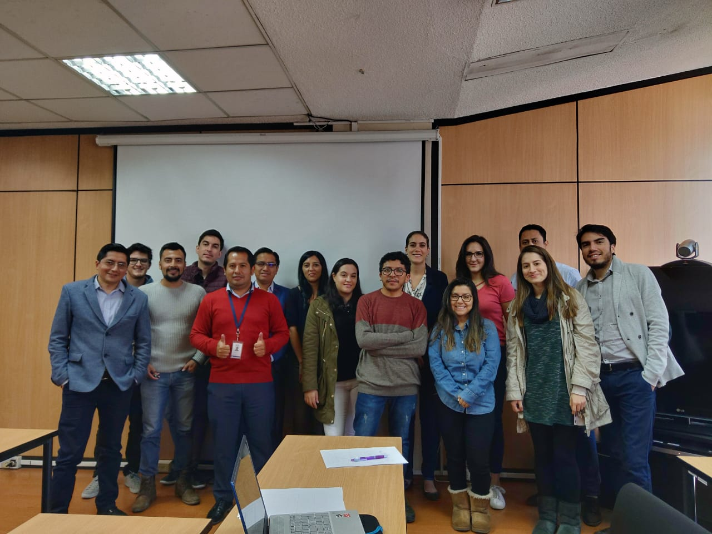

Hi, my name is Alex. I'm from Ecuador, I was born and raised in its capital city Quito, where I live in. I been working with data from the very first moment I got my engineering degree in Economic and Financial Sciences from National Polytechnic School (EPN). I have worked along side many public institutions from my country as a consultant. I got my own brewery called Zizek, now in stand by. 

I'm personally interested in how data can make a difference in public policy design. The most recent work was at the Social Lab, an initiative from Vital Strategies and the National Institute of Statistics and Census (INEC) which has three purposes: create quality information based on administrative records, make analysis and proposals of public policies with this information, and lately but not less important: share the information with the public.

I have imparted 4 courses until now: **R for acadamic documents design** at National Polytechnic school. **Development of Shiny apps** as part of my consultancy with UNICEF.
And **Specific knowledge of Social Lab tools** as part of my consultancy with Vital Strategies in both, National Institute of Statistics and Census, and the Ministry of Health.

 Download my resumé.
